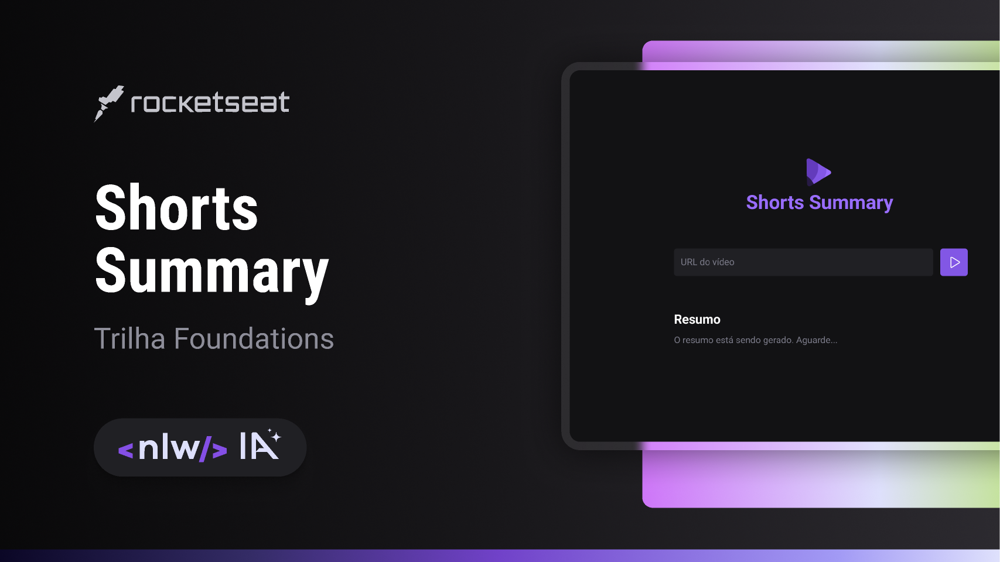

# NLW-IA
NLW-IA Rocketseat

 

  

## 🚀 Tecnologias

Esse projeto foi desenvolvido com as seguintes tecnologias:

- HTML e CSS
- JavaScript
- Git e Github
- Figma
- Inteligência artificial
- JS frameworks - NodeJs - Express - Axios - Cors - ytdl-core - Xenova

## 🔖 Layout

Você pode visualizar o layout do projeto através [DESSE LINK](https://www.figma.com/community/file/1282823495335498952). É necessário ter conta no [Figma](https://figma.com) para acessá-lo.
